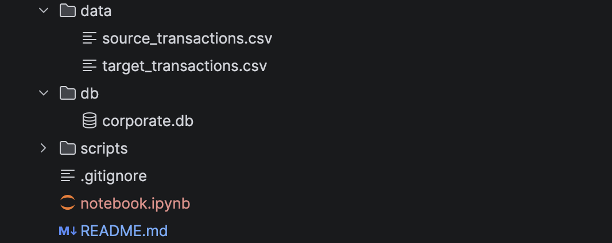
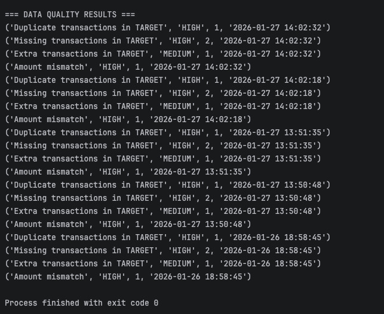
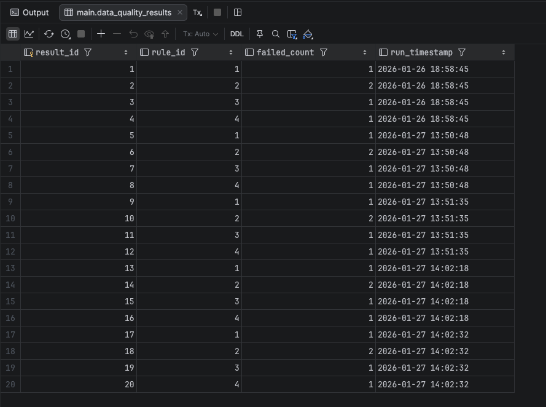

# Corporate Data Quality & Reconciliation Framework

## What this project does

This project is a small but realistic system that checks whether data stays correct when it moves from one system to another.

In many companies, transaction data is created in a **source system** and then copied into a **target system** for reporting. During this transfer, problems often appear like the missing records, duplicates, or mismatched values.

I built this project to simulate how organisations automatically detect these issues and track data quality over time using Python and SQL.

---

## How the system works

### 1. Input data (Source vs Target)

The project starts with two datasets:

- `source_transactions.csv` – represents the original system
- `target_transactions.csv` – represents the reporting system

Each dataset contains realistic transaction fields such as ID, account, amount, currency, type, date, and status.

These files simulate the kind of raw business data companies process every day.

---

### 2. Loading data into a database

Instead of analysing CSV files directly, the data is loaded into a SQLite database (`corporate.db`).

This creates two tables:

- `source_transactions`
- `target_transactions`

From this point on, **SQL handles validation logic**, and **Python automates execution**.

This mirrors how real data pipelines are structured.

---

### 3. Defining data quality rules

I created a rule catalogue stored in a table called `data_quality_rules`.

Each rule defines a business check, for example:

- Transaction IDs must be unique
- Source transactions must appear in the target
- Amounts must match between systems

Each rule also has a severity level to show how serious a failure is.

This separates **business rules from code**, which is a common data governance practice.

---

### 4. Running automated checks

A Python script runs SQL queries to evaluate these rules.

The system checks for:

- duplicates
- missing transactions
- extra records
- mismatched amounts
- invalid cancelled records

The SQL uses joins and aggregations to compare both systems.

---

### 5. Tracking results over time

Every time the checks run, results are saved in a table called `data_quality_results`.

This stores:

- which rule ran
- how many records failed
- when the check was executed

This creates a history of data quality performance, similar to monitoring systems used in real organisations.

---

## Why this project matters

This project demonstrates practical skills in:

- SQL joins and reconciliation logic
- Python automation
- rule-based system design
- data quality governance
- audit and monitoring concepts

It reflects how companies monitor data integrity in analytics and financial systems.

---

## Technology used

- Python
- SQL
- SQLite
